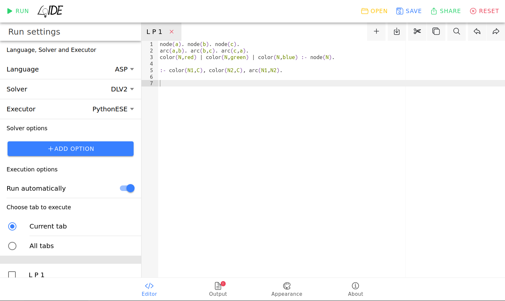

[](https://raw.githubusercontent.com/DeMaCS-UNICAL/LoIDE-PWA/master/LICENSE)
[](https://github.com/DeMaCS-UNICAL/LoIDE-PWA/releases/latest)
[](https://github.com/DeMaCS-UNICAL/LoIDE-PWA/issues)


# LoIDE-PWA

**Progressive Web App IDE for Logic Programming.**


## Purpose

The primary objective of LoIDE-PWA is to develop a Progressive Web App (PWA) that serves as an Integrated Development Environment (IDE) for Logic Programming, leveraging modern technologies and languages.

## Key Features

- Syntax highlighting
- Output highlighting
- Layout and appearance customization
- Keyboard shortcuts
- Multiple file support
- Execution and Solvers options definition
- Import and Export files
- Easy to use on mobile devices

## Getting Started

These instructions will get you a copy of the project up and running on your local machine.

### Prerequisites

To run LoIDE-PWA you need to have Node.js and npm installed on your system. You can download and install Node.js from the [official website](https://nodejs.org/).

If you want to use the server-side features of LoIDE, you need to have a server that can execute Logic programs. If you like it, you can use our [PythonESE](https://github.com/DeMaCS-UNICAL/PythonESE).

### Installation

To install LoIDE-PWA, first clone the repository using the following command:

```bash
git clone https://github.com/DeMaCS-UNICAL/LoIDE-PWA.git
```

Navigate to the cloned repository directory and install the required dependencies with npm:

```bash
npm install
```

Now you can run the application in development or production mode.

### Run in Development Mode

In the project directory, you can run:

```bash
npm start
```

Runs the app in the development mode.
Open [http://localhost:9000](http://localhost:9000) to view it in the browser.

The page will reload if you make edits.
You will also see any lint errors in the console.

### Run in Production Mode

```bash
npm run start:prod
```

Builds the app for production to the `build` folder and start a server that serve the build.

If you wish to run _LoIDE_ over HTTPS, you must provide paths to certificate files in the `server-config.json` file.
Then, you can start _LoIDE_ in a browser at [http://localhost:9001](http://localhost:9001)

### Testing

```bash
npm test
```

Launches the test runner in the interactive watch mode.
See the section about [running tests](https://facebook.github.io/create-react-app/docs/running-tests) for more information.

### Build

```bash
npm run build
```

Builds the app for production to the `build` folder.
It correctly bundles React in production mode and optimizes the build for the best performance.

# Dockerization

This repository provides also Docker containerization for LoIDE PWA.
Docker enables the encapsulation of the LoIDE GUI within a lightweight, portable container, ensuring smooth deployment across various environments.

## Getting Started

Deploying the LoIDE GUI using Docker is straightforward:

### Installation

Ensure Docker is installed on your system (refer to the [official Docker documentation](https://docs.docker.com/get-docker/) for installation instructions). Then, clone this repository using the following command:

```bash
git clone https://github.com/DeMaCS-UNICAL/LoIDE-PWA.git
```

### Building the Docker Image

A Docker image is a package that contains all the necessary to run application and it's used to create Docker containers. To create one navigate to the cloned repository directory and build the Docker image using the provided Dockerfile:

```bash
docker build -t loide-pwa .
```

### Running the Docker Container

Once the Docker image is built, you can run a Docker container using the following command:

```bash
docker run -d --network host --mount type=bind,source=[your/path/to/config],target=/app/config loide-pwa
```

The `--network host` option in the docker run command tells Docker to use the host network for the container. This means the container shares the same network stack as the host and can access network services running on the host directly.

The `--mount type=bind, source=[your/path/to/config], target=/app/config` option is used to create a bind mount. A bind mount is a type of mount that allows you to map a host file or directory to a container file or directory (for more information refer to the [official Docker documentation](https://docs.docker.com/storage/bind-mounts/)).
In this case we use mounts to provide the configuration file to the container. The configuration file is a JSON file that contains the configuration of the LoIDE PWA. It must be placed in a directory on the host and the _full_ path to this directory must be specified in the source option of the --mount option.
For examples on how to create the configuration file refer to the one provided in the repository. If no configuration file is provided the default configuration will be used.

Once the Docker container is running, you can open your web browser and navigate to `http://localhost:[specified-port]` to access the LoIDE GUI.

## Versioning

We use [Semantic Versioning](http://semver.org) for versioning. For the versions available, see the [releases on this repository](https://github.com/DeMaCS-UNICAL/LoIDE-PWA/releases).

## Credits

- Stefano Germano (_Coordinator_)
- Rocco Palermiti
- Marco Duca

From the [Department of Mathematics and Computer Science](https://www.mat.unical.it) of the [University of Calabria](http://unical.it)

## License

This project is licensed under the [MIT License](LICENSE)
